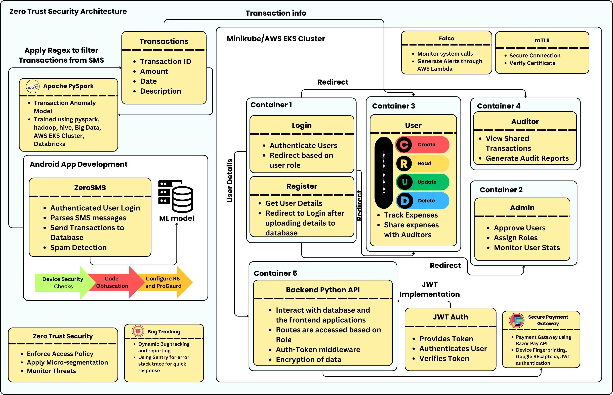
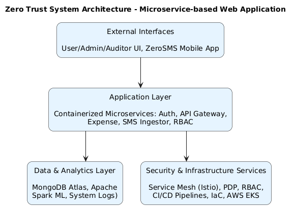
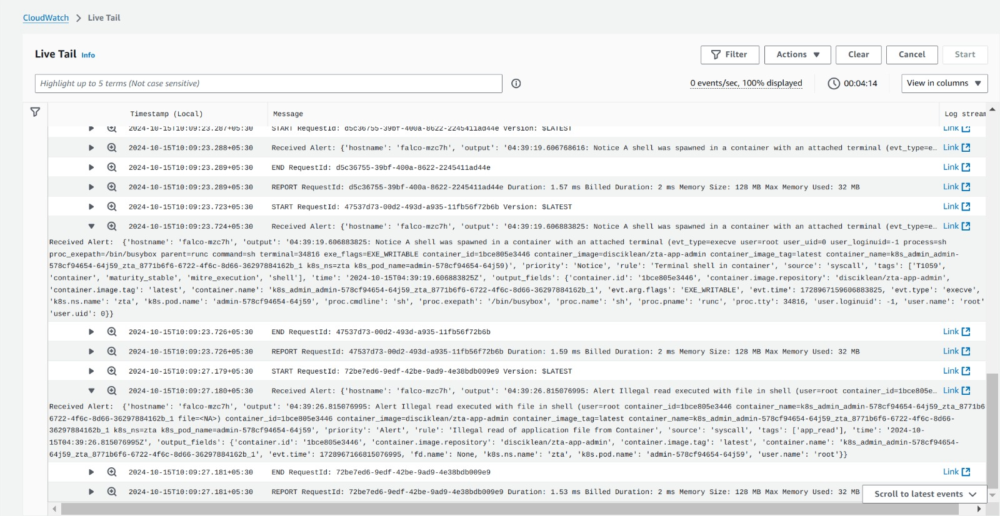
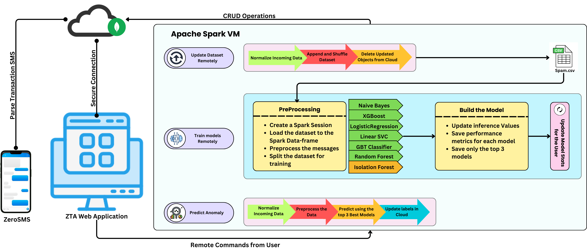
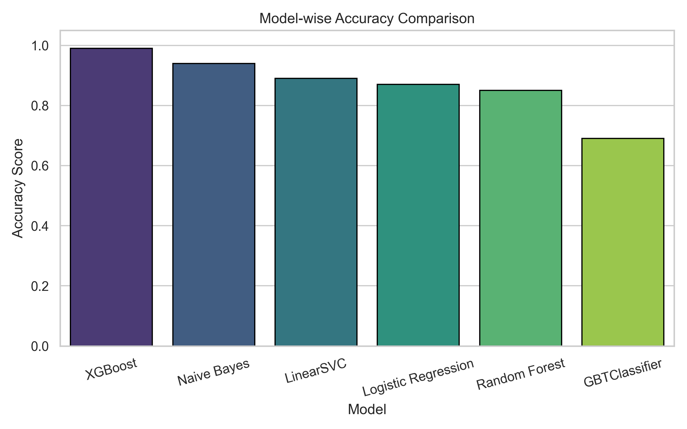
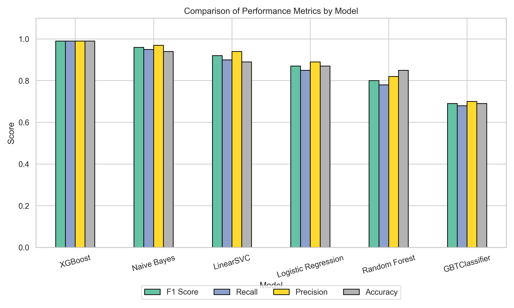

# Zero-Trust-App

## Description

This is a simple app that demonstrates the Zero Trust security model. The app is a simple web application that allows users to login and view their profile. The app is built using the Flask web framework and uses a Mongodb database to store user information.

## Installation

To install the app, you need to have Python and Mongodb installed on your machine. You can install the app by following these steps:

1. Clone the repository
2. Install the required packages using the command `pip install -r requirements.txt`
3. Run the app using the command `python app.py`
4. Open your browser and navigate to `http://localhost:5000`
5. You can now login using the default username and password: `admin` and `password`
6. You can also create a new account by clicking on the `Sign Up` link
7. After logging in, you can view your profile by clicking on the `Profile` link
8. You can also logout by clicking on the `Logout` link
9. To stop the app, press `Ctrl+C` in the terminal
10. To delete the app, simply delete the cloned repositorys

## Problem Identification

In today’s rapidly evolving digital landscape, traditional security models primarily rely onperimeter-based security, where authentication and authorization occur at the network boundary. However, this approach is ineffective against modern threats, especially incontainerized microservice environments. Once an attacker breaches the perimeter, they can move laterally within the system, escalating privileges and compromising sensitive data.

The widespread adoption ofcloud services, remote work, and distributed architectures has expanded the attack surface, making data and application security increasingly complex. Furthermore, managing permissions and access control inmicroservice architectures introduces additional vulnerabilities, making it difficult to enforce security policies effectively.

## Problem Statement

Given these challenges, there is a pressing need to transition from traditional perimeter-based security to a Zero Trust Architecture (ZTA). Zero Trust is built on the principle of"Never Trust, Always Verify," ensuring that every request, whether inside or outside the network, undergoes strictidentity verification, continuous monitoring, and least-privilege access control. Our project aims to bridge the security gaps indynamic and distributed containerized deployments by implementing a robust Zero Trust Security Framework for microservices.

## Project Significance

ImplementingZero Trust Architecture (ZTA) in containerized environments is critical for strengthening cybersecurity in modern applications. Given that containers areephemeral and dynamic, traditional perimeter-based security solutions are inadequate. Zero Trustenhances security posture, ensures compliance with industry regulations, and enables secure deployments for DevOps teams and IT security professionals.

Our project introducescontinuous identity verification, strict access controls, and advanced monitoring mechanisms to mitigate security risks effectively. These implementations not only secure applications but also provide organizations with ascalable, adaptable, and resilient security framework to counter evolving threats.

## Technical Stack

-Frontend: React.js, TailwindCSS, Redux

-Backend: Python (Flask), Node.js

-Big Data Processing: Apache Spark, PySpark, MLlib

-DevOps & Cloud Infrastructure: Docker, Kubernetes, AWS
EKS, Helm Chart, Git

-Database: MongoDB / AWS DynamoDB

-Security Features: JWT-based authentication, mTLS, Falco
runtime security, R8 for Android security

-Mobile App: React Native & Java

## Objectives & Scope

The key objectives of our project are:

1.Evaluate the security posture of existing containerized applications.

2.Develop a Zero Trust framework that enforces strict authentication and access control within microservices.

3.Implement a Proof-of-Concept (PoC) to validate Zero Trust principles in both web and mobile applications.

4.Conduct security testing, generate documentation, and analyze the effectiveness of our approach.

To achieve this, we designed a Zero Trust framework that enforces:

-Strict identity verification: Every user and service must be authenticated before accessing resources.

-Least-privilege access: Users and services receive only the necessary permissions required for their tasks.

-Continuous monitoring: All access attempts and system activities are logged and analyzed for anomalies.

-Microservice security enforcement: UsingJWT, mTLS, and Falco to secure inter-service communication and runtime behaviors.

## Architecture and Implementation

The architecture of our system integratesmultiple layers of
security:

1.JWT-based authentication: Each request carries a signed JWT token to verify identity.

2.mTLS-enabled secure communication: All microservices communicate usingmutual TLS (mTLS) to prevent unauthorized service interactions.

3.Policy Enforcement Points (PEP): Every API request is validated againstrole-based access control (RBAC) policies.

4.Falco runtime security: Falco continuously monitors the system for anomalies, detecting suspicious activities such as container escapes and unauthorized file access.

5.Secure mobile application: The Android app utilizesR8 obfuscation, ProGuard, and root detection to prevent reverse engineering and unauthorized modifications.

Security Enhancements in the Mobile App (ZeroSMS APK)

The ZeroSMS mobile app was designed with ahigh level of security to ensure data integrity and prevent unauthorized access. We implemented:

    -Root detection: Using theJailMonkey library to detect rooted or compromised environments.

    -Code obfuscation & performance optimization: UsingR8 and ProGuard to make reverse engineering significantly more challenging.

    -Secure key signing: The APK issigned with a trusted keystore, preventing tampering and unauthorized distribution.

    Our security assessment usingMobSF scanning showed asignificant improvement in security, with ZeroSMS achieving asecurity score of 57 (Grade B), 83.87% higher than a standard APK, which scored only31 (Grade C).

## Results and Analysis

Our Zero Trust implementation wasevaluated using a dataset for SMS-based spam detection, integrated into the expense tracking application. Several machine learning models were trained usingApache Spark MLlib, and the results showed:

-Naive Bayes performed best, with anF1 score of 0.918 and accuracy of 97.8%, ensuring balanced precision and recall.

-SVM had the highest precision (1.0) and ROC AUC score (0.984), making it excellent for strict spam detection.

-Random Forest and Gradient Boosting also performed well but with slightly lower F1 scores.

On theweb application side, the system was deployed on AWS EKS withKubernetes-managed node groups, ensuring:

-Scalability and fault tolerance

-Secure API access via JWT authentication

-Selective data sharing with auditors

-Dynamic role assignment for admin and auditors

Security monitoring wasenhanced using AWS Lambda and Falco, triggering real-time alerts foranomaly detection. Session logs provided a comprehensiveaudit trail, continuously monitoring user actions and enforcingZero Trust principles in every interaction.
